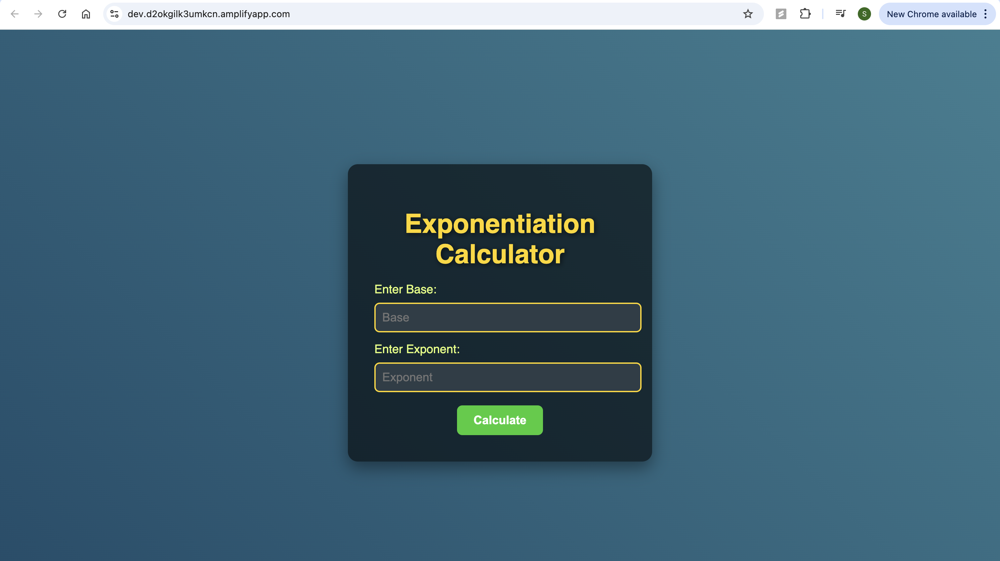

# Power of Math Project with AWS Amplify, Lambda, API Gateway, and DynamoDB
This project demonstrates how to build a web app that performs exponentiation calculations using AWS services including Amplify, Lambda, API Gateway, and DynamoDB.


Steps to Deploy
1. Create the Initial HTML Page
Create a local index.html file with the following content:
html
```
<!DOCTYPE html>
<html>
<head>
    <meta charset="UTF-8">
    <title>To the Power of Math!</title>
</head>

<body>
    To the Power of Math!
</body>
</html>
```
Zip the index.html file.

 
 
2. Set Up AWS Amplify
- Navigate to the AWS Amplify Console.
 

- Select Create new app and choose Deploy without Git.
  
 
  
- Provide the app name (e.g., PowerOfMath) and environment (e.g., dev).
  
 
  
- Drag and drop the index.html zip file you created.
  
 
  
- Click Save and Deploy.
  
- After deployment, click on the generated link to view the result.

 
  
4. Create the Lambda Function for Math Operation
- Navigate to the AWS Lambda Console.
  
  
   
- Click Create function, give it a name (e.g., ExponentiationFunction), and choose Python as the runtime.
  
  
  
In the Lambda function, replace the lambda_function.py content with the following Python code:
Python
```
import json
import math

def lambda_handler(event, context):
    mathResult = math.pow(int(event['base']), int(event['exponent']))
    return {
        'statusCode': 200,
        'body': json.dumps('Your result is ' + str(mathResult))
    }

```
   
   
- Save (Ctrl+S) and click on the Deploy button.
  
   

- Then test the function with an event:
json
```

{
    "base": 2,
    "exponent": 3
}

```


4. Set Up API Gateway
- Navigate to the API Gateway Console.


- Create a new REST API. Click on Build.


  
-  Give it a name (e.g., PowerOfMathAPI).
- 
- Create a new resource (e.g., /pow-of-math), and enable CORS.
 
- Create a new POST method for this resource,
 

-   Integrating it with the Lambda function and click on Create method.
  
   

- For enabling CORS on this method. Click on /pow-of-math and select Enable CORS.

   

- Select Access-Control-Allow-Methods as POST and save
    
- Deploy the API to a new stage (e.g., dev).
    
- Copy the Invoke URL generated after deployment.
 
   

- Test the integration by going to the Test tab.

  
  
  
5. Update Lambda Permissions for DynamoDB
- Navigate to the DynamoDB Console and create a new table with ID as the partition key.
   
   
- Copy the ARN of the table.

  
  
- Go to the Execution Role of your Lambda function, and create an inline policy to allow write permissions to the DynamoDB table.

  
  
  
  
Here’s the policy you can use:

json
Copy code
{
    "Version": "2012-10-17",
    "Statement": [
        {
            "Sid": "VisualEditor0",
            "Effect": "Allow",
            "Action": [
                "dynamodb:PutItem",
                "dynamodb:DeleteItem",
                "dynamodb:GetItem",
                "dynamodb:Scan",
                "dynamodb:Query",
                "dynamodb:UpdateItem"
            ],
            "Resource": "YOUR-TABLE-ARN"
        }
    ]
}


6. Update Lambda Function to Write to DynamoDB
Modify your Lambda function to save the result to DynamoDB:
python
```
import json
import math
import boto3
from time import gmtime, strftime

dynamodb = boto3.resource('dynamodb')
table = dynamodb.Table('PowerOfMathDatabase')
now = strftime("%a, %d %b %Y %H:%M:%S +0000", gmtime())

def lambda_handler(event, context):
    mathResult = math.pow(int(event['base']), int(event['exponent']))
    response = table.put_item(
        Item={
            'ID': str(mathResult),
            'LatestGreetingTime': now
        }
    )
    return {
        'statusCode': 200,
        'body': json.dumps('Your result is ' + str(mathResult))
    }
```


- Ensure the DynamoDB table name in the Lambda function matches your table.


- Click Deploy and test the function again.


7. Update HTML to Call API Gateway
Update the index.html page to integrate with API Gateway. Replace the fetch URL with your Invoke URL from API Gateway:
html

```
<!DOCTYPE html>
<html lang="en">
<head>
    <meta charset="UTF-8">
    <meta name="viewport" content="width=device-width, initial-scale=1.0">
    <title>Exponentiation Calculator</title>
    <!-- Modern styling for the UI -->
    <style>
        /* General body styling with a gradient background */
        body {
            background: linear-gradient(45deg, #1D4D6A, #3A7F92); /* Gradient from deep blue to teal */
            font-family: 'Roboto', sans-serif;
            color: #ffffff;
            margin: 0;
            padding: 0;
            display: flex;
            justify-content: center;
            align-items: center;
            height: 100vh;
        }

        /* Container for the form */
        .container {
            background-color: rgba(0, 0, 0, 0.6); /* Semi-transparent black background */
            padding: 40px;
            border-radius: 15px;
            box-shadow: 0 10px 25px rgba(0, 0, 0, 0.4);
            width: 100%;
            max-width: 380px;
            text-align: center;
        }

        h1 {
            color: #FFD700; /* Vibrant gold for the title */
            font-size: 2.5em;
            margin-bottom: 20px;
            text-shadow: 2px 2px 8px rgba(0, 0, 0, 0.6);
        }

        /* Label styles */
        label {
            color: #E1FF76; /* Soft lime green */
            font-size: 18px;
            margin-top: 15px;
            display: block;
            text-align: left;
        }

        /* Input field styling with a smooth design */
        input[type="number"] {
            padding: 10px;
            font-size: 18px;
            width: 100%;
            margin-top: 10px;
            background-color: #2E3D47; /* Dark background for inputs */
            color: #ffffff;
            border: 2px solid #FFD700; /* Gold border */
            border-radius: 8px;
            transition: border-color 0.3s ease;
        }

        /* Focus effect on input fields */
        input[type="number"]:focus {
            border-color: #32CD32; /* Lime green when focused */
            outline: none;
        }

        /* Button styling with vibrant colors */
        button {
            padding: 12px 25px;
            background-color: #32CD32; /* Vibrant lime green */
            color: #ffffff;
            font-size: 18px;
            font-weight: bold;
            border: none;
            cursor: pointer;
            margin-top: 20px;
            border-radius: 8px;
            transition: background-color 0.3s ease, transform 0.1s ease;
        }

        /* Hover effect for button */
        button:hover {
            background-color: #28A745; /* Slightly darker green */
            transform: scale(1.05); /* Slightly enlarge button on hover */
        }

        /* Button active effect */
        button:active {
            background-color: #218838; /* Darker green when clicked */
            transform: scale(0.98); /* Slightly shrink button on click */
        }

        /* Error or message display (if needed) */
        .error {
            color: #FF6347; /* Red color for error messages */
            font-size: 16px;
            margin-top: 15px;
        }

        /* Extra styling for responsive layout */
        @media (max-width: 480px) {
            h1 {
                font-size: 2em;
            }

            input[type="number"], button {
                font-size: 16px;
            }

            .container {
                padding: 20px;
                width: 90%;
            }
        }
    </style>
   <script>
        // callAPI function that takes the base and exponent numbers as parameters
        var callAPI = (base, exponent) => {
            // Convert base and exponent to numbers (in case they are passed as strings)
            base = Number(base);
            exponent = Number(exponent);

            // Check if base or exponent are not numbers
            if (isNaN(base) || isNaN(exponent)) {
                alert("Please enter valid numbers for both base and exponent.");
                return;
            }

            // Instantiate a headers object
            var myHeaders = new Headers();
            myHeaders.append("Content-Type", "application/json");

            // Prepare the body for the request
            var raw = JSON.stringify({"base": base, "exponent": exponent});

            // Create a JSON object with parameters for the API call
            var requestOptions = {
                method: 'POST',
                headers: myHeaders,
                body: raw,
                redirect: 'follow'
            };

            // Make the API call with parameters and handle the response
            fetch("https://q5b8rtxpq8.execute-api.us-east-1.amazonaws.com/Dev", requestOptions)
            .then(response => response.json())  // Parse the response as JSON
            .then(result => {
                if (result && result.body) {
                    alert("Result: " + result.body);  // Display the result
                } else {
                    alert("Error: Invalid response from API");
                }
            })
            .catch(error => {
                console.error('Error:', error);
                alert("There was an error processing the request. Please try again.");
            });  // Log any errors and show a generic error message
        };

        // Function to handle the form calculation
        function handleCalculation() {
            // Get the values from the form inputs
            var base = document.getElementById("base").value;
            var exponent = document.getElementById("exponent").value;

            // Check if both inputs are provided
            if (!base || !exponent) {
                alert("Please enter both base and exponent values.");
                return;  // Exit the function if either field is empty
            }

            // Call the API with the values from the form
            callAPI(base, exponent);
        }
    </script>
</head>
<body>
    <div class="container">
        <h1>Exponentiation Calculator</h1>
        <form>
            <label for="base">Enter Base:</label>
            <input type="number" id="base" placeholder="Base" required>

            <label for="exponent">Enter Exponent:</label>
            <input type="number" id="exponent" placeholder="Exponent" required>

            <button type="button" onclick="handleCalculation()">Calculate</button>
        </form>
    </div>
</body>
</html>


```


8. Re-deploy HTML Page Using AWS Amplify
Zip the updated index.html file.

Go back to AWS Amplify, upload the new zip file, and redeploy the app to the dev environment.

10. Test the Application
Click on the generated Amplify domain URL to see your exponentiation calculator in action.

Enter a base and exponent to get the result, which will also be saved in DynamoDB.

Technologies Used:
AWS Amplify: For hosting the web app.
AWS Lambda: To perform the exponentiation math operation.
AWS API Gateway: To expose the Lambda function as an API.
AWS DynamoDB: To store the calculation results.
