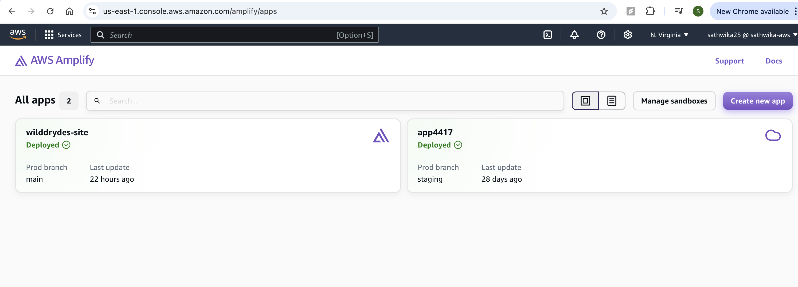
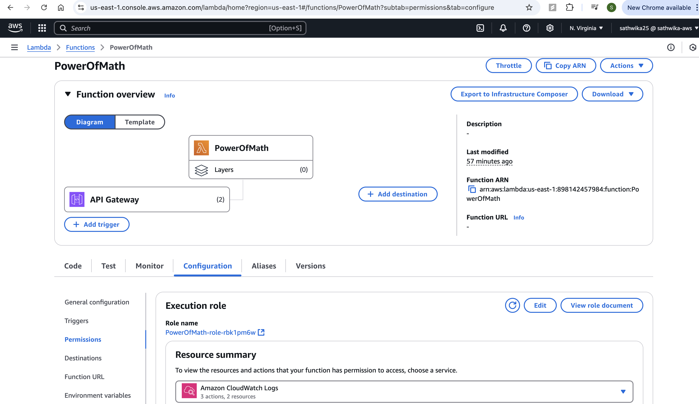

# Power of Math Project with AWS Amplify, Lambda, API Gateway, and DynamoDB
This project demonstrates how to build a web app that performs exponentiation calculations using AWS services including Amplify, Lambda, API Gateway, and DynamoDB.


Steps to Deploy
1. Create the Initial HTML Page
Create a local index.html file with the following content:
html
```
<!DOCTYPE html>
<html>
<head>
    <meta charset="UTF-8">
    <title>To the Power of Math!</title>
</head>

<body>
    To the Power of Math!
</body>
</html>
```
Zip the index.html file.

 
 
2. Set Up AWS Amplify
- Navigate to the AWS Amplify Console.
 

- Select Create new app and choose Deploy without Git.
  
 
  
- Provide the app name (e.g., PowerOfMath) and environment (e.g., dev).
  
 
  
- Drag and drop the index.html zip file you created.
  
 
  
- Click Save and Deploy.
  
- After deployment, click on the generated link to view the result.

 
  
4. Create the Lambda Function for Math Operation
- Navigate to the AWS Lambda Console.
  
  
   
- Click Create function, give it a name (e.g., ExponentiationFunction), and choose Python as the runtime.
  
  
  
In the Lambda function, replace the lambda_function.py content with the following Python code:
Python
```
import json
import math

def lambda_handler(event, context):
    mathResult = math.pow(int(event['base']), int(event['exponent']))
    return {
        'statusCode': 200,
        'body': json.dumps('Your result is ' + str(mathResult))
    }

```
   
   
- Save (Ctrl+S) and click on the Deploy button.
  
   

- Then test the function with an event:
json
```

{
    "base": 2,
    "exponent": 3
}

```


4. Set Up API Gateway
- Navigate to the API Gateway Console.


- Create a new REST API. Click on Build.


  
-  Give it a name (e.g., PowerOfMathAPI).
- 
- Create a new resource (e.g., /pow-of-math), and enable CORS.
 
- Create a new POST method for this resource,
 

-   Integrating it with the Lambda function and click on Create method.
  
   

- For enabling CORS on this method. Click on /pow-of-math and select Enable CORS.

   

- Select Access-Control-Allow-Methods as POST and save
    
- Deploy the API to a new stage (e.g., dev).
    
- Copy the Invoke URL generated after deployment.
 
   

- Test the integration by going to the Test tab.

  
  
  
5. Update Lambda Permissions for DynamoDB
- Navigate to the DynamoDB Console and create a new table with ID as the partition key.
   
   
- Copy the ARN of the table.

  
  
- Go to the Execution Role of your Lambda function, and create an inline policy to allow write permissions to the DynamoDB table.

  
  
  
  
Here’s the policy you can use:

json
Copy code
{
    "Version": "2012-10-17",
    "Statement": [
        {
            "Sid": "VisualEditor0",
            "Effect": "Allow",
            "Action": [
                "dynamodb:PutItem",
                "dynamodb:DeleteItem",
                "dynamodb:GetItem",
                "dynamodb:Scan",
                "dynamodb:Query",
                "dynamodb:UpdateItem"
            ],
            "Resource": "YOUR-TABLE-ARN"
        }
    ]
}


6. Update Lambda Function to Write to DynamoDB
Modify your Lambda function to save the result to DynamoDB:
python
```
import json
import math
import boto3
from time import gmtime, strftime

dynamodb = boto3.resource('dynamodb')
table = dynamodb.Table('PowerOfMathDatabase')
now = strftime("%a, %d %b %Y %H:%M:%S +0000", gmtime())

def lambda_handler(event, context):
    mathResult = math.pow(int(event['base']), int(event['exponent']))
    response = table.put_item(
        Item={
            'ID': str(mathResult),
            'LatestGreetingTime': now
        }
    )
    return {
        'statusCode': 200,
        'body': json.dumps('Your result is ' + str(mathResult))
    }
```


- Ensure the DynamoDB table name in the Lambda function matches your table.


- Click Deploy and test the function again.


7. Update HTML to Call API Gateway
Update the index.html page to integrate with API Gateway. Replace the fetch URL with your Invoke URL from API Gateway:
html
Copy code
<!DOCTYPE html>
<html lang="en">
<head>
    <meta charset="UTF-8">
    <meta name="viewport" content="width=device-width, initial-scale=1.0">
    <title>Exponentiation Calculator</title>
    <style>
        /* Styling as described earlier */
    </style>
    <script>
        function calculateExponentiation(base, exponent) {
            const headers = new Headers();
            headers.append("Content-Type", "application/json");

            const bodyData = JSON.stringify({ base, exponent });
            const requestOptions = {
                method: 'POST',
                headers: headers,
                body: bodyData,
                redirect: 'follow'
            };

            fetch("https://YOUR-INVOKE-URL-HERE", requestOptions)
                .then(response => response.json())
                .then(data => alert(`Result: ${data.body}`))
                .catch(error => console.error('Error:', error));
        }

        function handleCalculation() {
            const baseValue = document.getElementById('base-input').value;
            const exponentValue = document.getElementById('exponent-input').value;
            calculateExponentiation(baseValue, exponentValue);
        }
    </script>
</head>
<body>
    <div class="container">
        <h1>Exponentiation Calculator</h1>
        <form>
            <label for="base-input">Enter Base:</label>
            <input type="number" id="base-input" placeholder="Base" required>

            <label for="exponent-input">Enter Exponent:</label>
            <input type="number" id="exponent-input" placeholder="Exponent" required>

            <button type="button" onclick="handleCalculation()">Calculate</button>
        </form>
    </div>
</body>
</html>
8. Re-deploy HTML Page Using AWS Amplify
Zip the updated index.html file.
Go back to AWS Amplify, upload the new zip file, and redeploy the app to the dev environment.
9. Test the Application
Click on the generated Amplify domain URL to see your exponentiation calculator in action.
Enter a base and exponent to get the result, which will also be saved in DynamoDB.
Technologies Used:
AWS Amplify: For hosting the web app.
AWS Lambda: To perform the exponentiation math operation.
AWS API Gateway: To expose the Lambda function as an API.
AWS DynamoDB: To store the calculation results.
